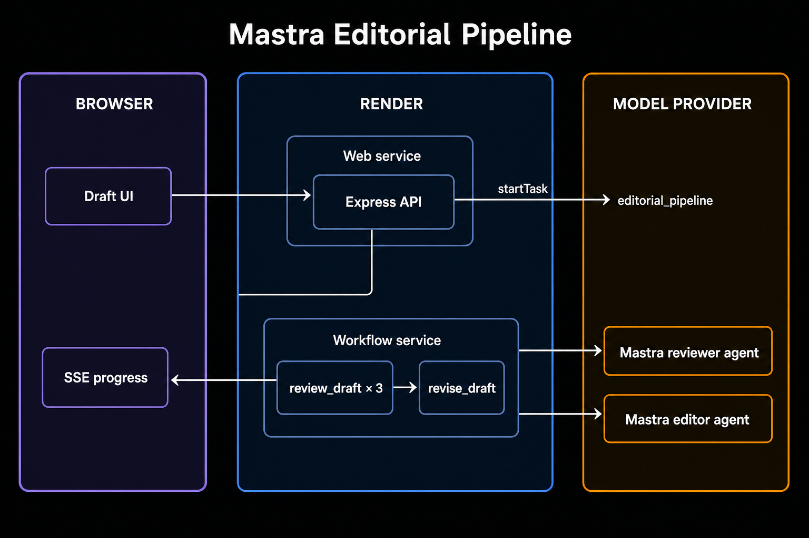
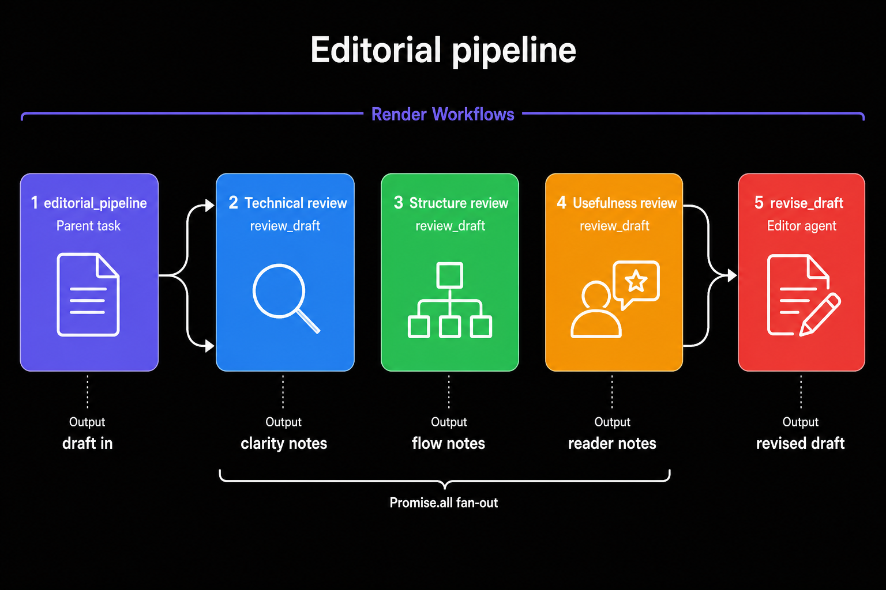

<div align="center">

# Mastra Editorial Pipeline

A distributed editorial pipeline combining **Render Workflows** for orchestration and **Mastra** agents for review and revision. Paste a draft and watch three reviewers run in parallel, then an editor rewrite the piece.

<p>
  <a href="https://render.com/deploy?repo=https://github.com/ojusave/render-workflows-mastra">
    
  </a>
</p>

<p>
  <a href="https://render.com">
    
  </a>
  <a href="https://mastra.ai">
    
  </a>
  <a href="https://discord.gg/gvC7ceS9YS">
    
  </a>
</p>

</div>

## What This Demo Shows

This repo demonstrates how to split a Mastra agent pipeline across Render Workflows tasks:

| Platform | Role |
| --- | --- |
| **[Render Workflows](https://render.com/docs/workflows)** | Queues each task on its own instance, with retries, timeouts, and parallel fan-out |
| **[Mastra](https://mastra.ai)** | Reviewer and editor agents, routed to your model provider via `MASTRA_MODEL` |
| **[Render Web Services](https://render.com/docs/web-services)** | Express API plus a live UI that streams progress over SSE |

## Architecture





### How It Works

1. **Browser** posts a draft to the **Express API** on Render
2. **Express** starts `editorial_pipeline` and streams progress via SSE
3. **Render Workflows** runs the parent task, which fans out three reviewer tasks, then revises:

| Render Workflow Task | Mastra agent | What it does |
| --- | --- | --- |
| `review_draft` | Reviewer | Comments on one focus: technical clarity, structure and flow, or reader usefulness |
| `revise_draft` | Editor | Rewrites the draft from the combined reviews |
| `editorial_pipeline` | — | `Promise.all` on the three reviews, then calls `revise_draft` |

4. The revised draft and the three reviews stream back to the browser

Calling `reviewDraft()` and `reviseDraft()` from the parent task creates chained runs. Each run gets its own compute plan, timeout, and retry policy.

## Quick Start

### Prerequisites

- [Render account](https://dashboard.render.com/register?utm_source=github&utm_medium=referral&utm_campaign=ojus_demos&utm_content=readme_link)
- An API key from a [Mastra model provider](https://mastra.ai/models) (OpenAI, Anthropic, Google, and others)

### Deploy

1. Click **Deploy to Render** above
2. You will be prompted for:
   - `RENDER_API_KEY` — [create one here](https://render.com/docs/api#1-create-an-api-key)

3. Create the Workflow service (Blueprints do not define Workflows yet):
   - Go to [Render Dashboard](https://dashboard.render.com) → **New** → **Workflow**
   - Connect this repository
   - Build command: `npm install && npm run build`
   - Start command: `node dist/tasks/index.js`
   - Name: `render-workflows-mastra-workflow`
   - Add env vars: `MASTRA_MODEL` (for example `openai/gpt-4o-mini`) and the matching provider key (`OPENAI_API_KEY`, `ANTHROPIC_API_KEY`, or `GOOGLE_API_KEY`)

4. Open the web service URL, load the sample draft, and click **Run pipeline**

The Render CLI can create the same Workflow service:

```bash
./scripts/create-workflow-on-render.sh
```

## Features

| Feature | Description |
| --- | --- |
| **Parallel reviews** | Three `review_draft` runs start together via `Promise.all` |
| **Independent retries** | A flaky model call retries that review without restarting the others |
| **Per-task compute** | Reviewers use `starter`; the editor uses `standard` with a longer timeout |
| **Live progress** | The UI streams SSE events while the parent task runs |
| **Provider-agnostic models** | Set `MASTRA_MODEL=provider/model-name`; Mastra reads the matching API key |

## Configuration

| Variable | Where | Description |
| --- | --- | --- |
| `RENDER_API_KEY` | Web service | [Render API key](https://render.com/docs/api#1-create-an-api-key) for dispatching tasks |
| `WORKFLOW_SLUG` | Web service | Must match the Workflow slug (`render-workflows-mastra-workflow` by default) |
| `MASTRA_MODEL` | Workflow service | Model router string such as `openai/gpt-4o-mini` or `anthropic/claude-sonnet-4-6` |
| Provider API key | Workflow service | `OPENAI_API_KEY`, `ANTHROPIC_API_KEY`, or `GOOGLE_API_KEY` depending on `MASTRA_MODEL` |
| `POLL_INTERVAL_MS` | Web service | How often Express polls the parent task (default 3000) |

## Project Structure

```
main.ts                      Express API + SSE streaming
pipeline/orchestrator.ts     Starts editorial_pipeline and polls status
mastra/agents.ts             Reviewer and editor agents
mastra/index.ts              Mastra instance
tasks/
  editorial.ts               review_draft, revise_draft, editorial_pipeline
  index.ts                   Workflow service entry (registers tasks)
shared/editorial.ts          Shared focuses and result types
render.yaml                  Web service Blueprint
```

## API Routes

| Method | Path | Description |
| --- | --- | --- |
| `GET` | `/` | Editorial UI |
| `GET` | `/health` | Health check |
| `POST` | `/review` | `{ "draft": "..." }` → SSE stream (`status`, `done`, `error`) |

## Troubleshooting

| Problem | Solution |
| --- | --- |
| Tasks fail immediately | Set `MASTRA_MODEL` and the matching provider key on the **workflow** service, not only the web service |
| `startTask` returns but nothing runs | `WORKFLOW_SLUG` must match the Workflow slug in Dashboard → Workflow → General |
| Empty model output | The task throws and retries; check the model name against [Mastra's router](https://mastra.ai/models) |
| Web service cannot dispatch | Set `RENDER_API_KEY` on the web service |

## Learn More

**Render:**
- [Render Workflows Documentation](https://render.com/docs/workflows)
- [Defining tasks](https://render.com/docs/workflows-defining)
- [Render Developers Discord](https://discord.gg/gvC7ceS9YS)

**Mastra:**
- [Mastra agents](https://mastra.ai/docs/agents/overview)
- [Model router](https://mastra.ai/models)

## License

[MIT](LICENSE)
